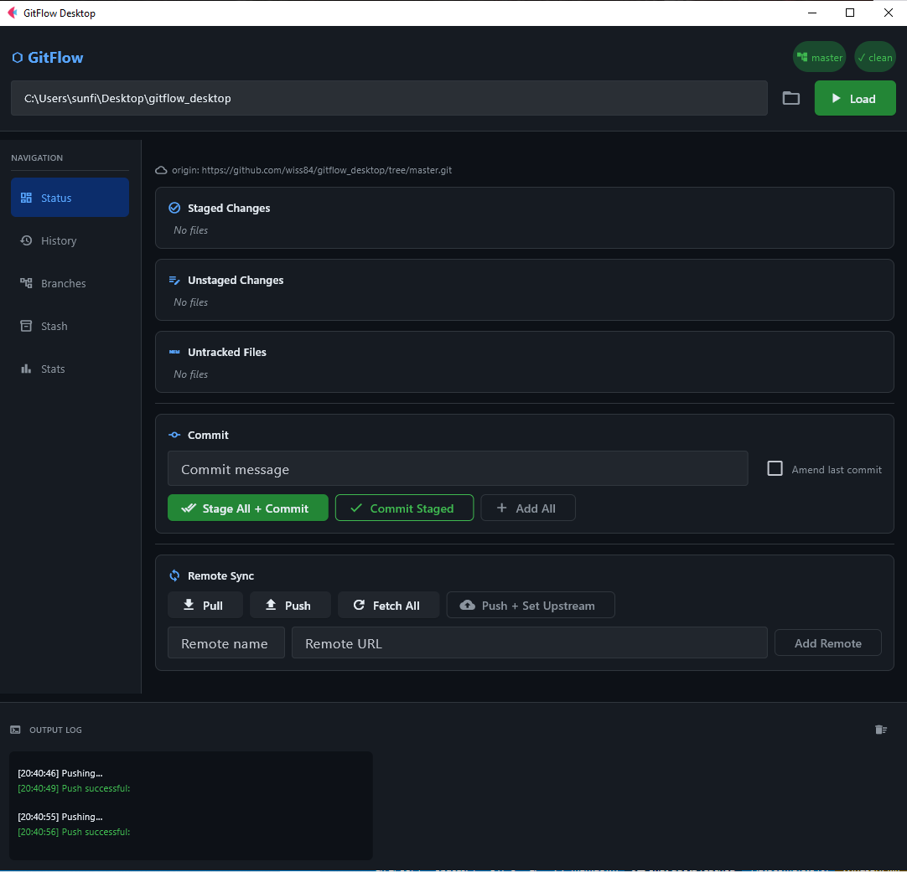

# GitFlow Desktop

A modern, cross-platform desktop GUI for Git and GitFlow workflows. Built with [Flet](https://flet.dev) (Flutter × Python), GitFlow Desktop provides an intuitive visual interface for managing Git repositories without memorizing command-line syntax.



---

## Features

### Repository Management
- **Quick repo loading** — paste a local path or browse with a file picker
- **Status overview** — see staged, unstaged, and untracked files at a glance
- **Remote sync** — pull, push, fetch, and set upstream with one click
- **Initialize new repos** — `git init` from the UI

### Commit Workflow
- **Stage/unstage files** — granular control with a single click
- **Discard changes** — revert files to HEAD (with confirmation)
- **View diffs** — inline syntax-highlighted diff viewer
- **Amend commits** — fix the last commit without editing the message
- **Commit All + Commit** — stage and commit in one action

### Branch Operations
- **List local & remote branches** — clearly separated with current branch highlighted
- **Create branches** — from any existing commit
- **Switch branches** — fast checkout with disabled state for current branch
- **Delete branches** — safe deletion with confirmation (protected for current)
- **Merge** — merge any branch into the current one
- **Tags** — create and view tags

### Stash Management
- **Stash changes** — optional stash message
- **Pop latest** — apply and remove the most recent stash
- **Stash list** — view all stashes with ref and message

### Repository Insights
- **Stats dashboard** — total commits, top contributors, remote URLs
- **Commit history** — last 50 commits with one-click checkout
- **Live log output** — terminal-style log with color-coded messages

### UI/UX
- **Dark theme** — easy on the eyes with carefully chosen colors
- **Responsive layout** — sidebar navigation + scrollable content
- **Status badges** — branch name and dirty/clean state always visible
- **Confirmation dialogs** — destructive actions require explicit confirmation

---

## Installation

### Prerequisites
- **Python 3.11+**
- **Git** installed and available in PATH (the app shells out to the `git` CLI)
- **Flet** framework
- **Platforms:** Windows, macOS, Linux (any platform supported by Python + Flet)

### Setup

1. Clone the repository:
```bash
git clone https://github.com/wiss84/gitflow_desktop.git
cd gitflow_desktop
```

2. Install dependencies:
```bash
pip install -r requirements.txt
```

**requirements.txt**
```
flet==0.84.0
GitPython==3.1.47
```
> **Note:** `GitPython` is listed for future use but the app currently calls the `git` CLI via `subprocess`. Only `flet` is required to run.

### Running
```bash
python main.py
```

---

## Usage

Run the application:
```bash
python main.py
```

1. **Load a repository** — paste the directory path or click the folder icon to browse
2. The app will detect if it's a Git repo and populate all tabs
3. Use the **Status** tab to commit changes
4. Use **History** to review and checkout past commits
5. Use **Branches** to create, switch, merge, and delete branches
6. Use **Stash** to temporarily set aside changes
7. Use **Stats** for repository overview

### Keyboard Shortcuts
(No keyboard shortcuts are defined yet — all actions are button-click based.)

---

## How It Works

The app uses a `GitManager` class (in `git_manager.py`) that wraps subprocess calls to the `git` CLI. This provides full Git compatibility without relying on a specific library implementation. `GitPython` is included in `requirements.txt` for potential future enhancements but is not currently used.

**Key classes:**
- `GitFlowApp` — main UI controller (in `main.py`)
- `GitManager` — Git operations wrapper using `subprocess` (in `git_manager.py`)

---

## Development

### Project Structure
```
gitflow_desktop/
├── main.py           # Flet app and UI (GitFlowApp class)
├── git_manager.py    # Git CLI wrapper via subprocess (GitManager class)
├── README.md
└── requirements.txt  # flet, GitPython
```

### Adding Features
1. UI code lives in `main.py` within the `GitFlowApp` class
2. Git operations are methods in `GitManager`
3. Follow existing patterns: build UI in `_build_*` methods, handlers in `_handle_*`

### Known Issues
- Requires a working `git` executable in the system PATH
- Large repositories (>1000 files) may have slight UI lag in file lists
- Diff viewer limited to first 300 lines for performance
- `GitPython` is listed in requirements but not actively used yet

---

## Future Plans
- [ ] Migrate from subprocess to GitPython for more robust Git handling
- [ ] Confetti effect on successful push
- [ ] Drag-and-drop file staging
- [ ] Customizable hotkeys
- [ ] GitFlow feature/hotfix/release branching wizards
- [ ] Dark/light theme toggle
- [ ] Export log to file
- [ ] Native packaging with flet build (executables)

---

## License

MIT

---

## Credits

Built with ❤️ using [Flet](https://flet.dev) and [Git](https://git-scm.com/).
